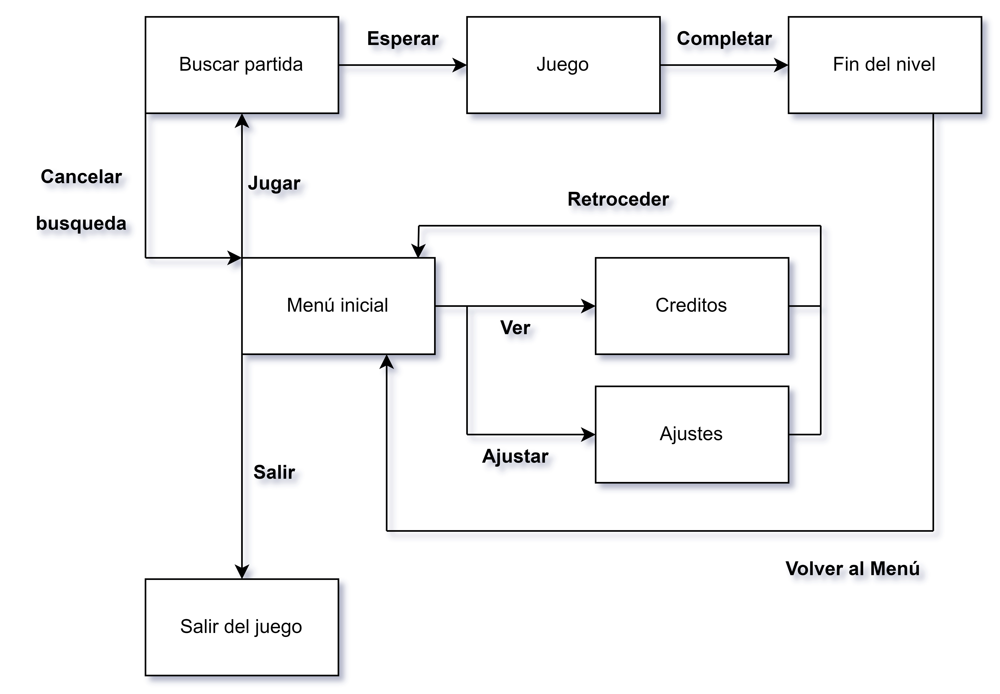
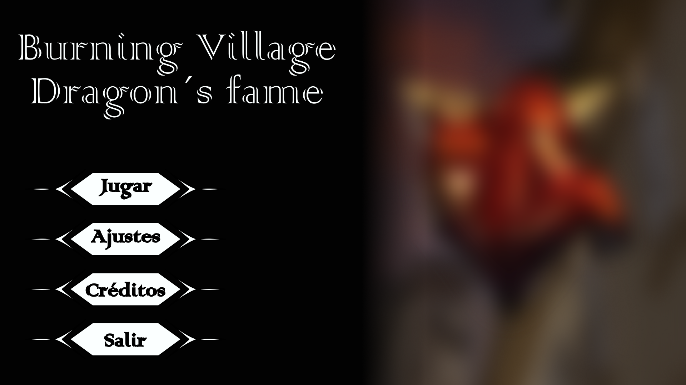
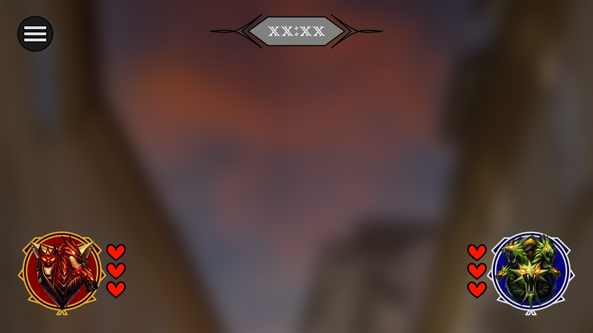
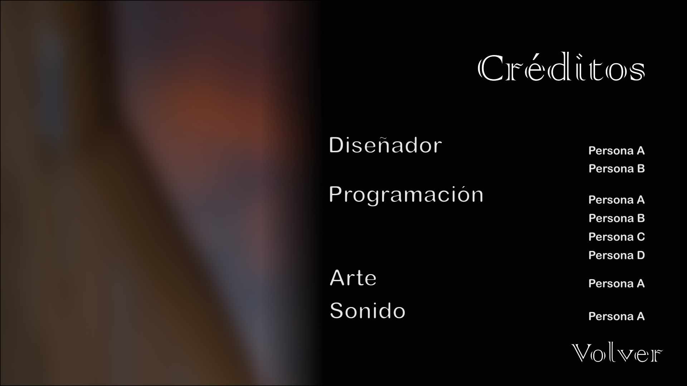
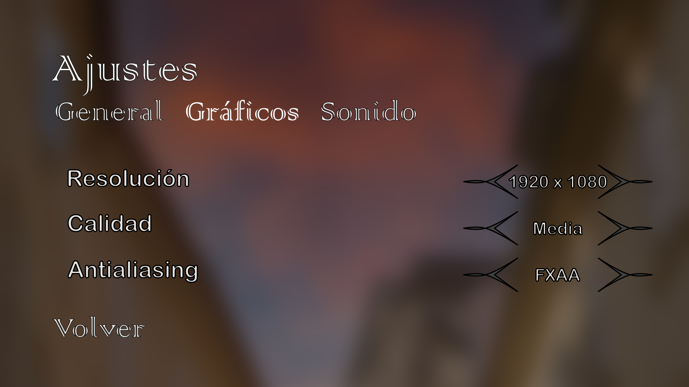

# GDDV3A-JuegosEnRed

# Burning Village: The Dragon's Flame

**Nombre del juego:** Burning Village: The Dragon's Flame

**Temática del juego:** Juego de estrategia, arcade y acción multijugador de temática fantástica medieval.

**Equipo de desarollo:**
- Luis Antonio González Martínez.
	- Correo: la.gonzalez.2021@alumnos.urjc.es
 	- Usuario de GitHub: Luangoma
- Daniel Rodríguez Ariza.
	- Correo: d.rodrigueza.2021@alumnos.urjc.es
 	- Usuario de GitHub: DanielRodriguezAriza
- Mario López García.
	- Correo: m.lopezgar.2021@alumnos.urjc.es
 	- Usuario de GitHub: mariolopp
- Juan Alessandro Vázquez Bustos.
	- Correo: ja.vazquez.2020@alumnos.urjc.es
 	- Usuario de GitHub: Sandro808

## Introducción

Lo siguiente es una propuesta para un juego casual de estrategia, acción y arcade con temática fantástica. ‘Burning Village: The Dragon’s Flame’ coge los elementos fantásticos medievales típicos, tales como dragones y pequeños pueblos, y los une en un videojuego de partidas con extrema rejugabilidad y entretenimiento. Este documento tiene como propósito describir los diversos aspectos que conforman el juego.

La siguiente información inicial está sujeta a expandirse y/o modificarse conforme avanza el desarrollo del juego.

### Concepto

En ‘Burning Village: The Dragon’s Flame’, el jugador se convierte en un dragón que sobrevuela una extensa aldea medieval compuesta por varias casas de piedra y madera y un enorme castillo. El jugador deberá combatir contra otro dragón enemigo para quemar la aldea con su fuego. Para ello, se enfrentarán a muerte para mantener la supremacía en aire y tierra, hasta que uno de los dos se imponga.

### Género

‘Burning Village: The Dragon’s Flame’ combina varios géneros de videojuegos. Tiene características de los siguientes tipos:

- **Estrategia en tiempo real:** el jugador debe utilizar el ingenio para sopesar sus acciones y su gestión de bienes o recursos para salir victorioso. En este juego, el jugador debe elegir con cuidado qué casas quemar, la extensión de su dominio, qué casas defender frente a un ataque enemigo, cuándo iniciar un ataque para conseguir más casas, entre otras cosas.
- **Arcade:** son simples, con controles básicos que facilitan un rápido aprendizaje del uso del juego que enganche al jugador, con partidas cortas que permiten la rejugabilidad. ‘Burning Village: The Dragon’s Flame’ tiene controles muy sencillos, moviendo al dragón y disparando llamas mediante escasas teclas del teclado. Sus partidas son rápidas y conducen fácilmente a ser jugado varias veces para continuar el reto y desarrollar nivel de maestría.
- **Videojuego casual:** con unas reglas y mecánicas simples, tiempo corto de adaptación para comenzar a jugar, y unas partidas de corta duración que permite que los jugadores no se comprometan a largo plazo. Este juego no posee ninguna historia ni desarrollo narrativo que el jugador deba conocer para jugar una partida.
- **Acción:** juegos en los que el jugador se enfrenta en combate contra uno o varios enemigos. La victoria depende de las habilidades del jugador, características como su coordinación y reflejos. En ‘Burning Village: The Dragon’s Flame’, el dragón del jugador debe luchar a muerte contra el dragón del enemigo usando las llamas que exhalan de su boca. La muerte del contrincante otorga ventajas al jugador que le permiten agrandar su dominio.

### Características principales

‘Burning Village: The Dragon’s Flame’ comprende las siguientes características pese a su aparente simplicidad:

- **Importancia de la estrategia:** Una parte fundamental del juego radica en saber escoger una estrategia acertada. Saber escoger las luchas y el momento de rendir ciertas posesiones, conocer el momento idóneo para atacar al enemigo, razonar qué casas quemar primero para fortalecer la posición, todos ellos son aspectos que dependen de la inteligencia y de la habilidad estratega.
- **Rejugabilidad:** Las partidas cortas y entretenidas hacen que el juego tenga potencial para ser altamente rejugable. El valor de rejugabilidad es clave para el éxito del juego.
- **Necesidad del ataque para conseguir la victoria:** Si bien al inicio de una partida ambos jugadores pueden evitar el ataque e ir escogiendo las casas que quemar, una vez todas estén bajo el dominio de uno u otro dragón el ataque es inevitable para avanzar la partida. La confrontación es un aspecto esencial para ganar.
- **Controles simples y accesibles:** El jugador tan solo debe aprender unos controles muy básicos de movimiento y de disparo de fuego mediante el teclado. Esto hace de ‘Burning Village: The Dragon’s Flame’ un juego con un alto nivel de accesibilidad para nuevos jugadores y con una rápida adquisición de familiaridad.
- **Una única habilidad que controlar:** A parte del movimiento por el mapa, el dragón tan solo dispone de una herramienta para conseguir posesiones y acabar con el enemigo: la habilidad para escupir fuego por su boca. Esto es en contraposición con los juegos más complejos que ponen decenas de habilidades a disposición del jugador, lo que los convierte en juegos con una curva de aprendizaje más exagerada.
- **Vista cenital reducida:** El jugador tan solo puede ver cierta parte del mapa, por lo que no conoce las acciones del enemigo si no está próximo a él. Al ignorar estos aspectos, se crea una sensación de misterio y suspense que no habría si el jugador conociera toda la información en todo momento. La vista es cenital y está centrada en el dragón del jugador.
- **Condición de victoria concisa:** El objetivo del jugador en todo momento es quemar la aldea entera con las llamas de su color. Para ello, debe evitar que el dragón enemigo queme casas, ya que quedarán como sus posesiones y por tanto, el fuego será del color enemigo.

### Público objetivo

El público de ‘Burning Village: The Dragon’s Flame’ es uno multigeneracional, personas de cualquier edad que tengan afición por la fantasía medieval y por la estrategia. Un público que disfrute productos como ‘Juego de Tronos’, ‘el Señor de los Anillos’, ‘Eragon’, o ‘The Witcher’; pero también juegos como ‘Risk’, ‘Eufloria’ o ‘Crusader Kings’.

Sobre todo, se dirige a un sector de la población muy ocupado, que desee entretenerse en sus escasos ratos libres compitiendo en una partida corta sin necesidad de seguir una historia o comprometerse a un juego de larga extensión. Usuarios con un tiempo limitado para jugar.

### Propósito

El propósito de ‘Burning Village: The Dragon’s Flame’ es el de ocupar un nicho poco explorado hasta el momento en el mundo de los videojuegos: el de los juegos casuales destinados a amantes de la fantasía, la estrategia y la acción medievales.

Hoy día, una gran mayoría de los juegos casuales están destinados a mujeres de mediana edad. Las personas fanáticas de la fantasía medieval también llevan vidas muy ajetreadas y sin apenas tiempo para dedicar a los juegos. Este juego es perfecto para ellas.

### Alcance

El alcance inicial es crear un videojuego de navegador web con Phaser 3 en JavaScript que implemente un back-end con una API REST y websockets.

Este juego inicial conformará una base sobre la que crear, en el futuro, diferentes modos de juego y niveles.

# Mecánicas
## Jugabilidad
En Burning Village The Dragon's flame destacan varias mecánicas jugables:

- **Movilidad:** En Burning Village se controlan dos dragones (uno cada jugador) que sobrevuelan la misma aldea compuesta de varios edificios. 

- **Fuego:** Cada dragón puede escupir fuego una vez cada 3 segundos.

- **Incendios:** Cuando alguno de los dragones incendia alguna de las distintas zonas de la aldea, estas quedan encendidas durante un periodo de tiempo por determinar.

- **Incendiar zonas ya incendiadas (opción 1):** Un dragón no puede incendiar una zona que ya ha sido encendida por su contrincante mientras este siga vivo. Por tanto para invadir la aldea debe asesinar a su contrincante.

- **Incendiar zonas ya incendiadas (opción 2):** Un dragón puede incendiar una zona que ya ha sido encendida por su contrincante mientras este sigue vivo soplando dos veces fuego sobre ella.
Si se hace mientras el contrincante está muerto, en lugar de dos solo es necesario soplar una vez. 
(todas estas métricas quedan sujetas a cambios con intención de crear un gameplay lo más divertido posible)

- **Asesinar dragones:** Cada dragón recibe/inflige un punto de vida de daño por cada bocanada de fuego que reciba/suelte.
Cada dragón cuenta con un número de puntos de vida aún por determinar.

- **Temporizador:** Hay un tiempo limitado para que uno de los dragones consiga quemar la aldea por completo. Si durante este plazo ninguno de los dos dragones ha sido capaz de controlar la aldea, el dragón con más zonas incendiadas al momento de finalizar el contador, será el ganador de la partida.

## Personajes
El juego consta de dos personajes jugables. Cada jugador controla un dragón de características similares.

Uno de ellos de color azul y otro de color rojo. Esta estética también se ve reflejada en las llamaradas, siendo de color naranja las del dragón de color rojo, y moradas las del de color azul.

## Movimiento y físicas
El movimiento de ambos dragones es muy simple. Pueden desplazarse por la pantalla sobrevolando la aldea utilizando el teclado (w, a, s, d; o las flechas) 
		Para disparar una bocanada de fuego se utilizará otra tecla
		del teclado aún por determinar.

También se está valorando la opción de un movimiento con el ratón, en el que el personaje seguiría constantemente al cursor y expulsaría fuego mediante click.

El juego no cuenta con físicas relevantes. Los dragones solo se mueven en 2D sobrevolando la aldea.

## Flujo de una partida
Durante esta sección se procederá a explicar cuál sería el curso de una partida común de Burning Village The Dragon's flame

Los jugadores inician el juego, lo primero que se les presenta es un menú con varias opciones, de las cuales seleccionarán la opción nueva partida.

Una vez la partida se haya cargado correctamente, tras una cuenta atrás, cada dragón aparece en uno de los extremos de la aldea, teniendo un rango de visión limitado a la zona por la que se desplazan, por lo que no necesariamente pueden conocer sus ubicaciones.

**Ataque a la aldea:** Una vez comienza la partida ambos dragones se desplazan a través de la aldea con la intención de incendiar la mayor parte de la misma. Una vez que todas las zonas han quedado incendiadas por las llamaradas de ambos dragones. 

- **A los jugadores se les presentan tres escenarios:**
Que las zonas controladas por el oponente sean considerablemente más numerosas que las propias. 
En este caso la respuesta más lógica será la de encontrar al dragón oponente lo antes posible para eliminarlo y proceder a la reconquista de las zonas que controlaba durante el tiempo de su reaparición aprovechando que durante este tiempo las zonas enemigas se pueden conquistar con menor esfuerzo (un soplido).

- **Que las zonas controladas por el oponente sean exageradamente menos numerosas a las propias.**
En este caso la opción más lógica será la de reconquistar las zonas opuestas sin ser eliminados por el oponente. A pesar de que las zonas requieren más esfuerzo para ser conquistadas mientras el oponente siga vivo. El riesgo de caer liquidado a manos del oponente y perder gran parte del control provoca que no valga la pena buscar pelea y que salga más a cuenta huir e intentar conquistar las zonas ajenas a pesar de necesitar dos soplidos para su conquista.

- **Que el oponente controle un número de zonas cercano al propio.**
En este caso la opción más lógica es que ambos dragones busquen eliminarse entre ellos, con la intención de poder aumentar su control de la zona durante el beneficio que aportará una hipotética baja del rival. 

Una vez uno de estos escenarios se ha cumplido (aunque variará en función de la forma de jugar de cada jugador) se seguirán cumpliendo escenarios similares contínuamente hasta que uno de los dragones se haga con todas las zonas o de que el temporizador se acabe. En este último caso el dragón que más zonas controle en el momento de finalizar el contador será el que gane la partida.

## Diseño de producto

### Experiencia del jugador y POV
El jugador asume el papel de un dragón en un mundo medieval.

El juego ofrece una vista reducida desde la perspectiva del dragón, lo que significa que el jugador no puede ver todo el mapa en su totalidad.

Los jugadores experimentarán la fantasía de ser un poderoso dragón capaz de volar y quemar casas medievales. La emoción del jugador proviene de descubrir nuevas zonas del mapa que están ocultas a su vista donde hay más territorios para conquistar.

Los jugadores sentirán una sensación de emoción, competencia y estrategia mientras compiten contra otro dragón para quemar casas y conquistar el castillo enemigo. La sensación de satisfacción y poder al quemar casas y la tensión de los enfrentamientos con el otro dragón serán fundamentales para la experiencia del jugador, ya que acentúan la sensación de poder y de conquista.

### Estilo visual y arte
El juego presenta una estética visual de mundo medieval con gráficos de pixel art. Las casas y castillos son representativos de esta época, estando hechos con ladrillos de piedra, madera y paja para recrear la estética de las edificaciones medievales.

El estilo visual evoca la sensación de un mundo medieval de fantasía y proporciona una experiencia nostálgica y encantadora para los jugadores.

### Audio
- **Música:** El juego contará con una banda sonora medieval que se adapta al ambiente del juego, creando una atmósfera inmersiva. En momentos de calma, la música será ambiental y alegre, contrastando con las músicas más dramáticas que sonarán al comenzar a destrozar las casas y al entrar en combate con otros dragones, siendo claramente diferenciables para que el jugador sepa en qué estado se encuentra. Durante el combate, la música sonará con un ritmo acelerado para incrementar la tensión durante la lucha contra un dragón enemigo.

- **Efectos de sonido:** Habrá efectos de sonido para las acciones del dragón, como el rugido, el fuego respirado y las colisiones, al recibir y causar daño. Las casas emitirán sonidos al estar en llamas y al derrumbarse. Todo con el objetivo de mejorar la experiencia auditiva del jugador e incrementar la inmersión en el papel de un dragón que está devastando todo lo que se encuentra a su paso.

### Mundo de ficción
- **Descripción del mundo:** El juego se desarrolla en un mundo de fantasía medieval donde los dragones compiten por quemar casas y conquistar un castillo, devastando por completo las ciudades humanas.

- **Narrativa relevante:** La narrativa se centra en la rivalidad entre los dragones y su lucha por el control del territorio.

### Monetización
El modelo de monetización es free to play (F2P). El juego es gratuito para jugar, lo que permite a los jugadores acceder a todas las características y funcionalidades sin costo alguno.

El objetivo es poder fidelizar a la mayor cantidad de jugadores posibles para dar a conocer a los desarrolladores del juego.
### Plataformas y tecnologías
El juego estará disponible como un juego web. Se podrá jugar en cualquier dispositivo capaz de ejecutar un navegador y conectarse con otros dispositivos.

Está desarrollado en JavaScript (JS) y permite jugar en multijugador, lo que permite que los jugadores puedan competir entre ellos en línea y en tiempo real.

# Interfaces
En este apartado, hablaremos de la importancia de la interfaz de usuario en Burning Village: The Dragon 's Flame, que no solo sea estéticamente atractiva, sino que también permita una experiencia de juego divertida. Desde la disposición de los controles hasta la presentación de información de la partida.
   
## Diagrama de flujo
El mapa de navegación por el menú se aprecian las opciones de búsqueda de partida, ajustes, créditos y salida del juego, es decir las opciones básicas. Se puede expresar visualmente de la siguiente forma:

## Menú principal
A continuación se mostrará un boceto de la sección menú principal.

Ahora se proporcionará una lista de elementos y las posibles opciones que tendrá dicha sección:
* Área del título: Área donde se muestra el nombre del juego.
* Ilustración: Área donde se muestran ilustraciones del juego.
* Botón Jugar: Dirige a la escena de Búsqueda de partida. También se puede usar el botón Barra espaciadora o Enter del teclado para acceder a la misma opción.
* Botón Ajustes: Dirige a la escena Ajustes, donde configurar la experiencia jugable.
* Botón Créditos: Dirige a la escena Créditos.
* Botón Salir: Permite al jugador salir del juego, después de una confirmación. También se puede usar el botón Escape del teclado para acceder a la misma opción.

## Buscar partida
A continuación se mostrará un boceto de la escena Buscar partida.

Ahora se proporcionará una lista de elementos y las posibles opciones que tendrá dicha sección:
* Estado de búsqueda: Muestra si se está buscando partida. También añade detalles de la búsqueda, como si está en cola, buscando sala etc.
* Botón Cancelar: Cancela la búsqueda de la partida y devuelve al menú principal. También se puede usar el botón Escape del teclado para acceder a la misma opción.

## Partida
A continuación se mostrará un boceto de la escena Partida.

Ahora se proporcionará una lista de elementos y las posibles opciones que tendrá dicha sección:
* Marcador: Muestra los puntos ganados de cada jugador
* Cronómetro: Indica el tiempo restante de la partida. Al llegar a cero, la partida termina y se comparan los puntos de los jugadores para decidir el estado de victoria.
* Vida: Indica la vida restante del jugador
* Botón Pausa: Pausa la partida para acceder a un menú rápido de opciones entre las que se encuentran las opciones de ajustes y salir de partida. Si el jugador sale de partida, contará como victoria para el contrincante y derrota para el que la selecciona. Durante la pausa, el juego no se detiene.
* Corazones: Muestra la vida que le queda al jugador. Al llegar a cero, el jugador muere y no puede jugar durante un periodo corto de tiempo (10 segundos).

## Final de nivel
A continuación se mostrará un boceto de la escena Final de nivel.

Ahora se proporcionará una lista de elementos y las posibles opciones que tendrá dicha sección:
* Detalles de partida: Muestra datos de la partida de las acciones realizadas por el jugador.
* Botón Continuar: Vuelve al menú principal. También se puede usar el botón barra espaciadora o Enter del teclado para acceder a la misma opción.

## Créditos
A continuación se mostrará un boceto de la escena Créditos.

Ahora se proporcionará una lista de elementos y las posibles opciones que tendrá dicha sección:
* Créditos: Permite ver quien se ha encargado de los diferentes componentes del juego.
* Botón Volver: Devuelve al menú principal. También se puede usar el botón Escape del teclado para acceder a la misma opción.

## Ajustes
A continuación se mostrará un boceto de la escena Ajustes.

Ahora se proporcionará una lista de elementos y las posibles opciones que tendrá dicha sección:
* Botón General: Despliega las opciones generales como el brillo y el idioma.
* Botón Gráficos: Despliega los ajustes de gráficos como la resolución.
* Botón Sonido: Despliega las opciones de sonido como el volumen y el dispositivo de reproducción.
* Botón Volver: Devuelve al menú principal. También se puede usar el botón Escape del teclado para acceder a la misma opción.

## Bibliografía

BoardgamingParent. (2023, 31 agosto). 7 Strategy games like Risk when you’re ready for more. BoardgamingParent.com. <https://boardgamingparent.com/6-great-games-like-risk-for-something-extra/>

Colaboradores de Wikipedia. (2023). Risk. Wikipedia, la enciclopedia libre. <https://es.wikipedia.org/wiki/Risk>

Colaboradores de Wikipedia. (2023). Videojuego de estrategia en tiempo real. Wikipedia, la enciclopedia libre. <https://es.wikipedia.org/wiki/Videojuego_de_estrategia_en_tiempo_real>

Colaboradores de Wikipedia. (2023). Género de videojuegos. Wikipedia, la enciclopedia libre. <https://es.wikipedia.org/wiki/G%C3%A9nero_de_videojuegos>

Colaboradores de Wikipedia. (2023). Arcade. Wikipedia, la enciclopedia libre. <https://es.wikipedia.org/wiki/Arcade>

Colaboradores de Wikipedia. (2023). Videojuego casual. Wikipedia, la enciclopedia libre. <https://es.wikipedia.org/wiki/Videojuego_casual>

¿Cuántos tipos de videojuegos hay? (2022, 20 julio). IFEMA MADRID. <https://www.ifema.es/noticias/videojuegos/tipos-videojuegos>

How middle-aged women are turning ‘casual’ gaming into a billion-dollar addiction. (2010, 18 diciembre). BrainStation. <https://brainstation.io/magazine/how-middle-aged-women-are-turning-casual-gaming-into-a-billion-dollar-addiction>

Stalberg, A. (2023). Games to play if you love medieval fantasy. Game Rant. <https://gamerant.com/games-play-love-medieval-fantasy/#divinity-original-sin-2>

What is the difference between casual and arcade game category? (s. f.). Quora. <https://www.quora.com/What-is-the-difference-between-casual-and-arcade-game-category>

Wikipedia contributors. (2023). Action Game. Wikipedia. <https://en.wikipedia.org/wiki/Action_game>
