# GDDV3A-JuegosEnRed

# Burning Village: The Dragon's Flame

**Nombre del juego:** Burning Village: The Dragon's Flame

**Temática del juego:** Juego de estrategia, arcade y acción multijugador de temática fantástica medieval.

**Equipo de desarollo:**
- Luis Antonio González Martínez.
	- Correo: la.gonzalez.2021@alumnos.urjc.es
 	- Usuario de GitHub: Luangoma
- Daniel Rodríguez Ariza.
	- Correo: d.rodrigueza.2021@alumnos.urjc.es
 	- Usuario de GitHub: DanielRodriguezAriza
- Mario López García.
	- Correo: m.lopezgar.2021@alumnos.urjc.es
 	- Usuario de GitHub: mariolopp
- Juan Alessandro Vázquez Bustos.
	- Correo: ja.vazquez.2020@alumnos.urjc.es
 	- Usuario de GitHub: Sandro808
    
## Video demostrativo

Link a YouTube: https://youtu.be/c5TNxFbuQyQ

## Plataformas
'Burning Village: The Dragon's Flame' está disponible en las siguientes plataformas:
- **itch.io:** <https://sandro808.itch.io/burning-village-the-dragons-flame>
- **Gamejolt:** <https://gamejolt.com/games/dragonsFlame/867660>
- **Newgrounds:** <https://www.newgrounds.com/portal/view/913289>
- **idev.games:** <https://idev.games/game/burning-village-the-dragon-s-flame>
- **indiedb:** <https://www.indiedb.com/games/burning-village-the-dragons-flame>

## Instrucciones
### Paso 1: Descarga de Eclipse STS
Ve al sitio web oficial de Eclipse STS: Spring Tools 4 - Eclipse.  
Descarga la versión adecuada para tu sistema operativo.
### Paso 2: Descomprimir los archivos
Una vez descargado, con tu programa de compresión de archivos, descomprime el archivo.  
Generará cuatro archivos de los cuales uno de ellos será otra carpeta comprimida _"contents"_, la cual se deberá descomprimir tambien.  
En el caso de que sea un _.jar_ y tengas una version de Java instalada anteriormente en tu computador, el proceso es más sencillo, simplemente ejecuta el _.jar_.
### Paso 3: Ejecutar Eclipse STS
Accede a la carpeta donde se encuentra la instalación de Eclipse STS y ejecuta el archivo ejecutable correspondiente a tu sistema aoperativo.
### Paso 4: Configuracion inicial
Una vez abierto y cargado el programa, este nos preguntará nuestro área de trabajo (directorio).  
Especificado el área, los archivos del proyecto deben de estar en el interior de esta.  
Abre el proyecto desde el sistema de archivos y seleccionas la carpeta del proyecto.  
_(File >> Open Proyects from File system)_
### Paso 5: Ejecución del proyecto
Para ejecutar el proyecto, se puede proceder de 2 formas:  

**Ejecución desde la interfaz de STS:**  
Para su ejecución, deberemos abrir los difrentes desplegables hasta llegar a la aplicación java. 
_(BurningVillageServer > src/main/java > com.dragon.game >> BurningVillageServerApplication.java)_
Luego, debemos hacer click derecho sobre _BurningVillageServerApplication.java_ y ejecutarlo como una aplicacion de JAVA.  
_(Run As >> Java Application)_

**Ejecución desde la línea de comandos:**  
En Eclipse STS, se selecciona el proyecto _BurningVillageServer_ en el explorador de paquetes. Se selecciona la opción _Run > Run As > Maven Build_ y se configura el Goal _package_.
Se busca el directorio en el que se encuentra el archivo .jar resultante y se abre un terminal. Se ejecuta el con el comando `java -jar BurningVillageServer-0.0.1-SNAPSHOT.jar`, especificando opcionalmente otros parámetros de configuración del servidor (eg: cambiar el puerto `--server.port=27015`).
Para facilitar la ejecución por línea de comandos, se ha creado una serie de scripts (_run_server.bat_ y _run_server.sh_) que ejecutan el comando automáticamente.
### Paso 6: Conexión al servidor
Se puede acceder al servidor por medio de un navegador accediendo al URL correspondiente (_http://ip:puerto_). El archivo encargado de cargar el juego en el lado del cliente es _index.html_, por lo que no es necesario especificar ningún archivo en la ruta al acceder al servidor.  

**Acceso por dirección local:**  
Por defecto, la aplicación se cargará en localhost (127.0.0.1) y en el puerto 8080.  
_http://localhost:8080 | http://127.0.0.1:8080 | http://[::1]:8080_  

**Acceso por dirección pública:**  
En caso de haber abierto el puerto en el que reside el servidor, se puede acceder por medio de la IP pública, permitiendo así el acceso de otros clientes agenos a la red local al servidor.

## Introducción

Lo siguiente es una propuesta para un juego casual de estrategia, acción y arcade con temática fantástica. ‘Burning Village: The Dragon’s Flame’ coge los elementos fantásticos medievales típicos, tales como dragones y pequeños pueblos, y los une en un videojuego de partidas con extrema rejugabilidad y entretenimiento. Este documento tiene como propósito describir los diversos aspectos que conforman el juego.

La siguiente información inicial está sujeta a expandirse y/o modificarse conforme avanza el desarrollo del juego.

### Concepto

En ‘Burning Village: The Dragon’s Flame’, el jugador se convierte en un dragón que sobrevuela una extensa aldea medieval compuesta por varias casas de piedra y madera y un enorme castillo. El jugador deberá combatir contra otro dragón enemigo para quemar la aldea con su fuego. Para ello, se enfrentarán a muerte para mantener la supremacía en aire y tierra, hasta que uno de los dos se imponga.

### Género

‘Burning Village: The Dragon’s Flame’ combina varios géneros de videojuegos. Tiene características de los siguientes tipos:

- **Estrategia en tiempo real:** el jugador debe utilizar el ingenio para sopesar sus acciones y su gestión de bienes o recursos para salir victorioso. En este juego, el jugador debe elegir con cuidado qué casas quemar, la extensión de su dominio, qué casas defender frente a un ataque enemigo, cuándo iniciar un ataque para conseguir más casas, entre otras cosas.
- **Arcade:** son simples, con controles básicos que facilitan un rápido aprendizaje del uso del juego que enganche al jugador, con partidas cortas que permiten la rejugabilidad. ‘Burning Village: The Dragon’s Flame’ tiene controles muy sencillos, moviendo al dragón y disparando llamas mediante escasas teclas del teclado. Sus partidas son rápidas y conducen fácilmente a ser jugado varias veces para continuar el reto y desarrollar nivel de maestría.
- **Videojuego casual:** con unas reglas y mecánicas simples, tiempo corto de adaptación para comenzar a jugar, y unas partidas de corta duración que permite que los jugadores no se comprometan a largo plazo. Este juego no posee ninguna historia ni desarrollo narrativo que el jugador deba conocer para jugar una partida.
- **Acción:** juegos en los que el jugador se enfrenta en combate contra uno o varios enemigos. La victoria depende de las habilidades del jugador, características como su coordinación y reflejos. En ‘Burning Village: The Dragon’s Flame’, el dragón del jugador debe luchar a muerte contra el dragón del enemigo usando las llamas que exhalan de su boca. La muerte del contrincante otorga ventajas al jugador que le permiten agrandar su dominio.

### Características principales

‘Burning Village: The Dragon’s Flame’ comprende las siguientes características pese a su aparente simplicidad:

- **Importancia de la estrategia:** Una parte fundamental del juego radica en saber escoger una estrategia acertada. Saber escoger las luchas y el momento de rendir ciertas posesiones, conocer el momento idóneo para atacar al enemigo, razonar qué casas quemar primero para fortalecer la posición, todos ellos son aspectos que dependen de la inteligencia y de la habilidad estratega.
- **Rejugabilidad:** Las partidas cortas y entretenidas hacen que el juego tenga potencial para ser altamente rejugable. El valor de rejugabilidad es clave para el éxito del juego.
- **Necesidad del ataque para conseguir la victoria:** Si bien al inicio de una partida ambos jugadores pueden evitar el ataque e ir escogiendo las casas que quemar, una vez todas estén bajo el dominio de uno u otro dragón el ataque es inevitable para avanzar la partida. La confrontación es un aspecto esencial para ganar.
- **Controles simples y accesibles:** El jugador tan solo debe aprender unos controles muy básicos de movimiento y de disparo de fuego mediante el teclado. Esto hace de ‘Burning Village: The Dragon’s Flame’ un juego con un alto nivel de accesibilidad para nuevos jugadores y con una rápida adquisición de familiaridad.
- **Una única habilidad que controlar:** A parte del movimiento por el mapa, el dragón tan solo dispone de una herramienta para conseguir posesiones y acabar con el enemigo: la habilidad para escupir fuego por su boca. Esto es en contraposición con los juegos más complejos que ponen decenas de habilidades a disposición del jugador, lo que los convierte en juegos con una curva de aprendizaje más exagerada.
- **Vista cenital reducida:** El jugador tan solo puede ver cierta parte del mapa, por lo que no conoce las acciones del enemigo si no está próximo a él. Al ignorar estos aspectos, se crea una sensación de misterio y suspense que no habría si el jugador conociera toda la información en todo momento. La vista es cenital y está centrada en el dragón del jugador.
- **Condición de victoria concisa:** El objetivo del jugador en todo momento es mantener la mayor parte de la aldea con las llamas de su color. Para ello, debe evitar que el dragón enemigo incendie casas, ya que quedarán como sus posesiones y por tanto, el fuego será del color enemigo.

### Público objetivo

El público de ‘Burning Village: The Dragon’s Flame’ es uno multigeneracional, personas de cualquier edad que tengan afición por la fantasía medieval y por la estrategia. Un público que disfrute productos como ‘Juego de Tronos’, ‘el Señor de los Anillos’, ‘Eragon’, o ‘The Witcher’; pero también juegos como ‘Risk’, ‘Eufloria’ o ‘Crusader Kings’.

Sobre todo, se dirige a un sector de la población muy ocupado, que desee entretenerse en sus escasos ratos libres compitiendo en una partida corta sin necesidad de seguir una historia o comprometerse a un juego de larga extensión. Usuarios con un tiempo limitado para jugar.

### Propósito

El propósito de ‘Burning Village: The Dragon’s Flame’ es el de ocupar un nicho poco explorado hasta el momento en el mundo de los videojuegos: el de los juegos casuales destinados a amantes de la fantasía, la estrategia y la acción medievales.

Hoy día, una gran mayoría de los juegos casuales están destinados a mujeres de mediana edad. Las personas fanáticas de la fantasía medieval también llevan vidas muy ajetreadas y sin apenas tiempo para dedicar a los juegos. Este juego es perfecto para ellas.

### Alcance

El alcance inicial es crear un videojuego de navegador web con Phaser 3 en JavaScript que implemente un back-end con una API REST y websockets.

Este juego inicial conformará una base sobre la que crear, en el futuro, diferentes modos de juego y niveles.

# Mecánicas
## Jugabilidad
En Burning Village The Dragon's flame destacan varias mecánicas jugables:

- **Movilidad:** En Burning Village se controlan dos dragones (uno cada jugador) que sobrevuelan la misma aldea compuesta de varios edificios.
  Los dragones no pueden dejar de moverse, pudiendo únicamente modificar la dirección de su movimiento.
Implementado

- **Fuego:** Cada dragón recarga sus 60 llamas cada 3 segundos.
Implementado

- **Incendios:** Cuando alguno de los dragones incendia alguna de las distintas zonas de la aldea, estas quedan encendidas durante toda la partida, perdiendo un punto de vida cada segundo desde dicho momento. 
Implementado

- **Incendiar zonas ya incendiadas (opción 1: no implementada):** Un dragón no puede incendiar una zona que ya ha sido encendida por su contrincante mientras este siga vivo. Por tanto para invadir la aldea debe asesinar a su contrincante.

- **Incendiar zonas ya incendiadas (opción 2: no implementada):** Un dragón puede incendiar una zona que ya ha sido encendida por su contrincante soplando dos veces fuego sobre ella.
Si se hace mientras el contrincante está muerto, en lugar de dos solo es necesario soplar una vez.
(todas estas métricas quedan sujetas a cambios con intención de crear un gameplay lo más divertido posible)

- **Incendiar zonas ya incendiadas (opción implementada finalmente):** Un dragón puede incendiar una casa que ya ha sido encendida por su contrincante siempre y cuando esta casa permanezca aún en pie.
  Si una casa ha sido destruida, queda asignada definitivamente al dragón que la ha destruido. Perdiendo el rival la posibilidad de recuperarla.

- **Asesinar dragones:** Cada dragón recibe/inflige un punto de vida de daño por cada llama de fuego que reciba/suelte. 
Cada dragón cuenta con un número de puntos de vida aún por determinar.
Implementado, el dragon tiene 100 puntos de vida base.

- **Temporizador:** Hay un tiempo limitado para que uno de los dragones consiga quemar la aldea por completo.
  Si durante este plazo ninguno de los dos dragones ha sido capaz de controlar la aldea, el dragón con más zonas incendiadas al momento de finalizar el contador, será el ganador de la partida.
Implementado. Se puede ganar si se controlan mas casas que el rival en el momento en que se acaba el tiempo.

## Personajes
El juego consta de dos personajes jugables. Cada jugador controla un dragón de características similares.

Uno de ellos de color azul y otro de color rojo. Esta estética también se ve reflejada en las llamaradas, siendo de color naranja las del dragón de color rojo, y moradas las del de color azul.

## Movimiento y físicas
El movimiento de ambos dragones es muy simple. Pueden desplazarse por la pantalla sobrevolando la aldea utilizando el teclado ('a', 'd'; o las flechas 'izq', 'der') 
		Para disparar una bocanada de fuego se utilizará la flecha 'arriba' o tecla 'w'.

También se está valorando la opción de un movimiento con el ratón, en el que el personaje seguiría constantemente al cursor y expulsaría fuego mediante click.

El juego no cuenta con físicas relevantes. Los dragones solo se mueven en 2D sobrevolando la aldea.

## Estadísticas del juego actuales
- Dragón: 100 ps
- Casa: 300 ps
- Incendios: 1ps/seg
- Daño por cada llama: 1 ps
- Recarga de las llamas: 3 seg/ 60 llamas
- Tope de llamas acumulable: 60 llamas

## Flujo de una partida
Durante esta sección se procederá a explicar cuál sería el curso de una partida común de Burning Village The Dragon's flame

Los jugadores inician el juego, lo primero que se les presenta es un menú con varias opciones, de las cuales seleccionarán la opción nueva partida.

Una vez la partida se haya cargado correctamente, tras una cuenta atrás, cada dragón aparece en uno de los extremos de la aldea, teniendo un rango de visión limitado a la zona por la que se desplazan, por lo que no necesariamente pueden conocer sus ubicaciones.

**Ataque a la aldea:** Una vez comienza la partida ambos dragones se desplazan a través de la aldea con la intención de incendiar la mayor parte de la misma. 

- **A los jugadores se les presentan tres escenarios:**
Que las zonas controladas por el oponente sean considerablemente más numerosas que las propias. 
En este caso la respuesta más lógica será la de encontrar al dragón oponente lo antes posible para eliminarlo y proceder a la reconquista de las zonas que controlaba durante el tiempo de su reaparición aprovechando que durante este tiempo las zonas enemigas se pueden conquistar con menor esfuerzo (se cuenta con fuego ilimitado durante dicho periodo).

- **Que las zonas controladas por el oponente sean exageradamente menos numerosas a las propias.**
En este caso la opción más lógica será la de reconquistar las zonas opuestas sin ser eliminados por el oponente. A pesar de que las zonas requieren más esfuerzo para ser conquistadas mientras el oponente siga vivo. El riesgo de caer liquidado a manos del oponente y perder gran parte del control provoca que no valga la pena buscar pelea y que salga más a cuenta huir e intentar conquistar las zonas ajenas a pesar de contar con menos llamas para su conquista.

- **Que el oponente controle un número de zonas cercano al propio.**
En este caso la opción más lógica es que ambos dragones busquen eliminarse entre ellos, con la intención de poder aumentar su control de la zona durante el beneficio que aportará una hipotética baja del rival. 

Una vez uno de estos escenarios se ha cumplido (aunque variará en función de la forma de jugar de cada jugador) se seguirán cumpliendo escenarios similares contínuamente hasta que uno de los dragones se haga con todas las zonas o de que el temporizador se acabe. En este último caso el dragón que más zonas controle en el momento de finalizar el contador será el que gane la partida.

## Diseño de producto

### Experiencia del jugador y POV
El jugador asume el papel de un dragón en un mundo medieval.

El juego ofrece una vista reducida desde la perspectiva del dragón, lo que significa que el jugador no puede ver todo el mapa en su totalidad.

Los jugadores experimentarán la fantasía de ser un poderoso dragón capaz de volar y quemar casas medievales. La emoción del jugador proviene de descubrir nuevas zonas del mapa que están ocultas a su vista donde hay más territorios para conquistar.

Los jugadores sentirán una sensación de emoción, competencia y estrategia mientras compiten contra otro dragón para quemar casas y conquistar el castillo enemigo. La sensación de satisfacción y poder al quemar casas y la tensión de los enfrentamientos con el otro dragón serán fundamentales para la experiencia del jugador, ya que acentúan la sensación de poder y de conquista.

### Estilo visual y arte
El juego presenta una estética visual de mundo medieval con gráficos de pixel art. Las casas y castillos son representativos de esta época, estando hechos con ladrillos de piedra, madera y paja para recrear la estética de las edificaciones medievales.

El estilo visual evoca la sensación de un mundo medieval de fantasía y proporciona una experiencia nostálgica y encantadora para los jugadores.

### Audio
- **Música:** El juego contará con una banda sonora medieval que se adapta al ambiente del juego, creando una atmósfera inmersiva. En momentos de calma, la música será ambiental y alegre, contrastando con las músicas más dramáticas que sonarán al comenzar a destrozar las casas y al entrar en combate con otros dragones, siendo claramente diferenciables para que el jugador sepa en qué estado se encuentra. Durante el combate, la música sonará con un ritmo acelerado para incrementar la tensión durante la lucha contra un dragón enemigo.
No implementado

- **Efectos de sonido:** Habrá efectos de sonido para las acciones del dragón, como el rugido, el fuego respirado y las colisiones, al recibir y causar daño. Las casas emitirán sonidos al estar en llamas y al derrumbarse. Todo con el objetivo de mejorar la experiencia auditiva del jugador e incrementar la inmersión en el papel de un dragón que está devastando todo lo que se encuentra a su paso.
No implementado

### Mundo de ficción
- **Descripción del mundo:** El juego se desarrolla en un mundo de fantasía medieval donde los dragones compiten por quemar casas y conquistar un castillo, devastando por completo las ciudades humanas.

- **Narrativa relevante:** La narrativa se centra en la rivalidad entre los dragones y su lucha por el control del territorio.

### Monetización
El modelo de monetización es free to play (F2P). El juego es gratuito para jugar, lo que permite a los jugadores acceder a todas las características y funcionalidades sin costo alguno.

El objetivo es poder fidelizar a la mayor cantidad de jugadores posibles para dar a conocer a los desarrolladores del juego.
### Plataformas y tecnologías
El juego estará disponible como un juego web. Se podrá jugar en cualquier dispositivo capaz de ejecutar un navegador y conectarse con otros dispositivos.

Está desarrollado en JavaScript (JS) y permite jugar en multijugador, lo que permite que los jugadores puedan competir entre ellos en línea y en tiempo real.

# Interfaces
En este apartado, hablaremos de la importancia de la interfaz de usuario en Burning Village: The Dragon 's Flame, que no solo sea estéticamente atractiva, sino que también permita una experiencia de juego divertida. Desde la disposición de los controles hasta la presentación de información de la partida.
   
## Diagrama de flujo
El mapa de navegación por el menú se aprecian las opciones de búsqueda de partida, ajustes, créditos y salida del juego, es decir las opciones básicas. Se puede expresar visualmente de la siguiente forma: 

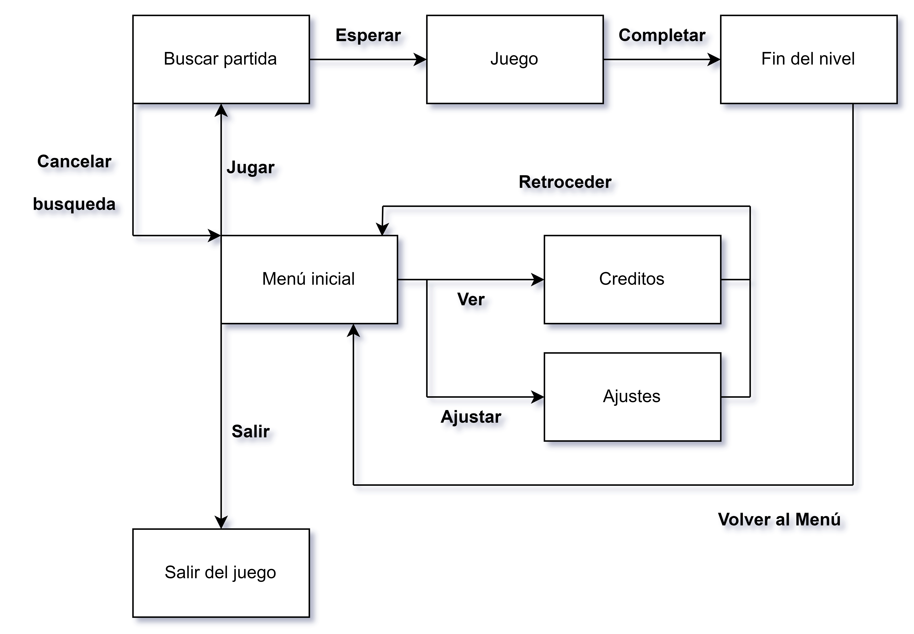

## Menú principal
A continuación se mostrará un boceto de la sección menú principal.

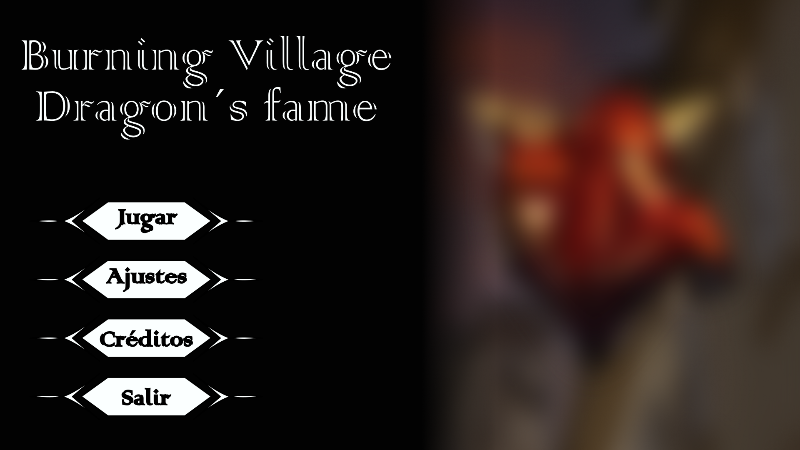

Ahora se proporcionará una lista de elementos y las posibles opciones que tendrá dicha sección:
* Área del título: Área donde se muestra el nombre del juego.
* Ilustración: Área donde se muestran ilustraciones del juego.
* Botón Jugar: Dirige a la escena de Búsqueda de partida. También se puede usar el botón Barra espaciadora o Enter del teclado para acceder a la misma opción.
* Botón Ajustes: Dirige a la escena Ajustes, donde configurar la experiencia jugable.
* Botón Créditos: Dirige a la escena Créditos.
* Botón Tutorial: Contiene la información necesaria para comprender el funcionamiento y los controles del juego.
* Botón Salir: Permite al jugador salir del juego, después de una confirmación. También se puede usar el botón Escape del teclado para acceder a la misma opción.

## Buscar partida
A continuación se mostrará un boceto de la escena Buscar partida.

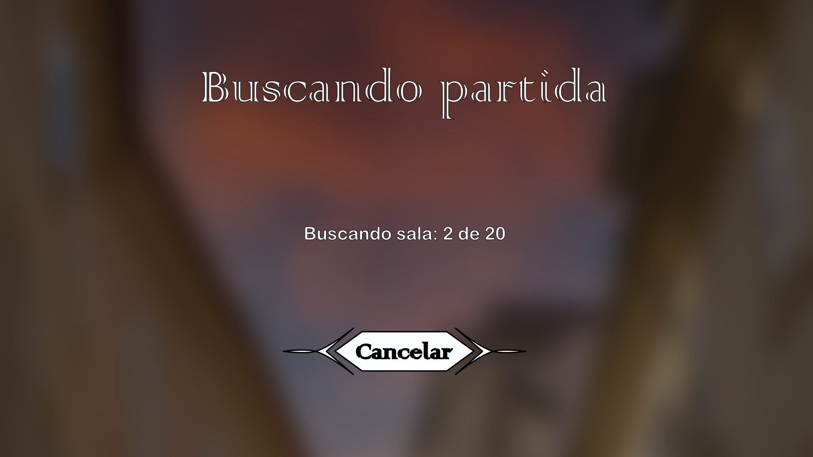

Ahora se proporcionará una lista de elementos y las posibles opciones que tendrá dicha sección:
* Estado de búsqueda: Muestra si se está buscando partida. También añade detalles de la búsqueda, como si está en cola, buscando sala etc.
* Botón Cancelar: Cancela la búsqueda de la partida y devuelve al menú principal. También se puede usar el botón Escape del teclado para acceder a la misma opción.

## Partida
A continuación se mostrará un boceto de la escena Partida.

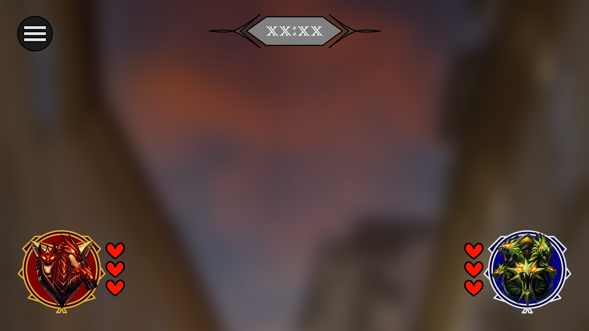

Ahora se proporcionará una lista de elementos y las posibles opciones que tendrá dicha sección:
* Marcador: Muestra los puntos ganados de cada jugador
* Cronómetro: Indica el tiempo restante de la partida. Al llegar a cero, la partida termina y se comparan los puntos de los jugadores para decidir el estado de victoria.
* Barra de vida: Indica la vida restante del jugador
* Botón Pausa: Pausa la partida para acceder a un menú rápido de opciones entre las que se encuentran las opciones de ajustes y salir de partida. Si el jugador sale de partida, contará como victoria para el contrincante y derrota para el que la selecciona. Durante la pausa, el juego no se detiene.

## Final de nivel
A continuación se mostrará un boceto de la escena Final de nivel.

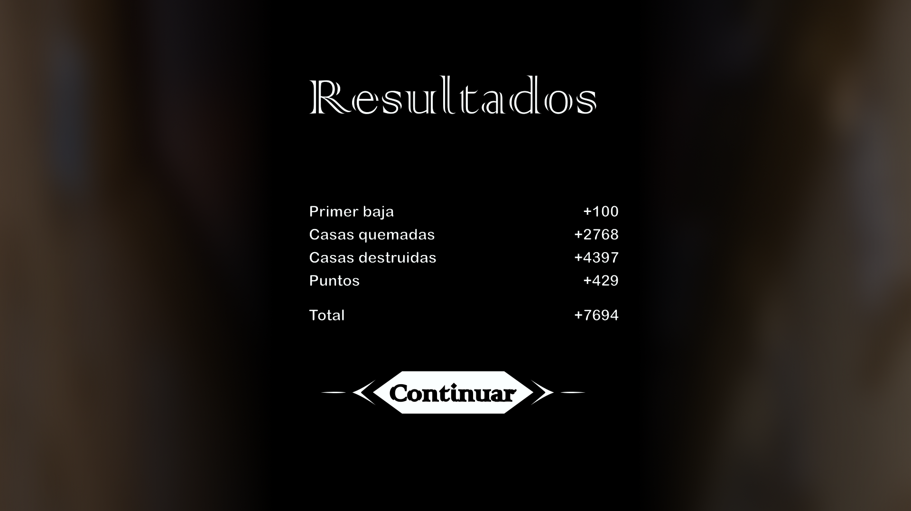

Ahora se proporcionará una lista de elementos y las posibles opciones que tendrá dicha sección:
* Detalles de partida: Muestra datos de la partida de las acciones realizadas por el jugador.
* Botón Continuar: Vuelve al menú principal. También se puede usar el botón barra espaciadora o Enter del teclado para acceder a la misma opción.

## Créditos
A continuación se mostrará un boceto de la escena Créditos.

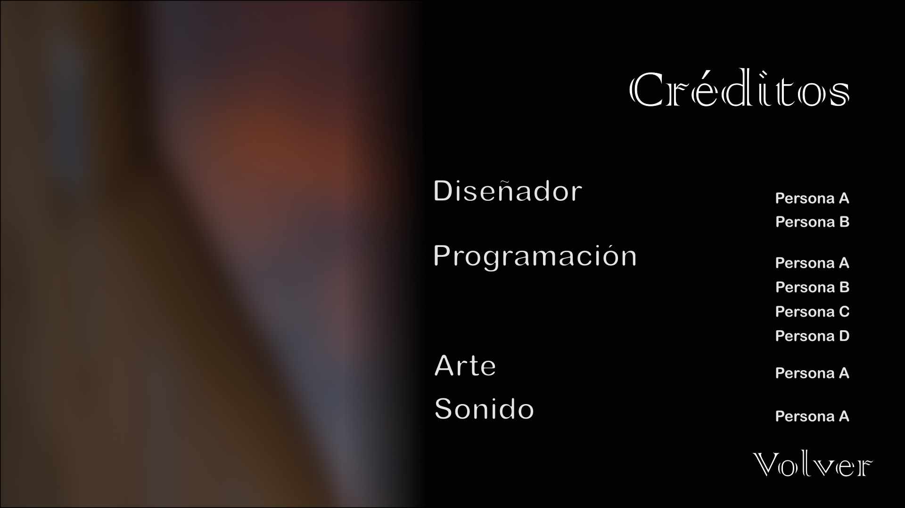

Ahora se proporcionará una lista de elementos y las posibles opciones que tendrá dicha sección:
* Créditos: Permite ver quien se ha encargado de los diferentes componentes del juego.
* Botón Volver: Devuelve al menú principal. También se puede usar el botón Escape del teclado para acceder a la misma opción.

## Ajustes
A continuación se mostrará un boceto de la escena Ajustes.

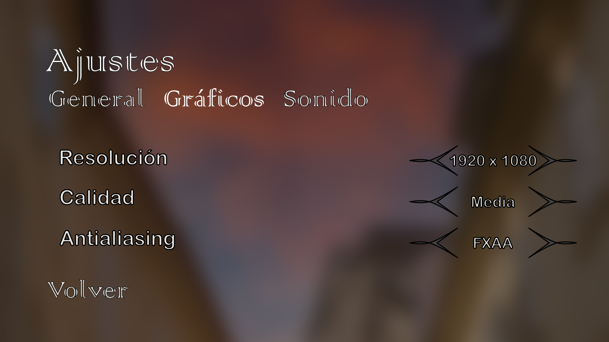

Ahora se proporcionará una lista de elementos y las posibles opciones que tendrá dicha sección:
* Botón General: Despliega las opciones generales como el brillo y el idioma.
* Botón Gráficos: Despliega los ajustes de gráficos como la resolución.
* Botón Sonido: Despliega las opciones de sonido como el volumen y el dispositivo de reproducción.
* Botón Volver: Devuelve al menú principal. También se puede usar el botón Escape del teclado para acceder a la misma opción.

# Fase 2: Estado del desarrollo (03/12/23)
| Funcion                            | Estado de la implementacion | Fase de finalización | Comentarios |
| ---------------------------------- | --------------------------- | -------------------- | ----------- |
| Escenas                            | Implementado                | Fase 2               |             |
| Menú                               | Implementado                | Fase 2               |             |
| Nivel                              | Implementado                | Fase 2               |             |
| Buscar partida                     | Por implementar             | - Fase 4             |             |
| Resultados                         | Implementado                | Fase 2               |             |
| Creditos                           | Implementado                | Fase 2               |             |
| Ajustes                            | Por implementar             | - Fase 4             |El botón esta implementado pero no tiene función|
| Sonidos                            | Por implementar             | - Fase 4             |             |
| Dragones                           | Implementado                | Fase 2               |             |
| Llamas                             | Implementado                | Fase 2               |             |
| Casas                              | Implementado                | Fase 2               |El valor de la casa son de 5 puntos|
| Sistema de puntuación              | Implementado                | Fase 2               |             |
| Barra de vida                      | Implementado                | Fase 2               |El dragon tiene 100 puntos de vida base|
| Matar dragones                     | Implementado                | Fase 2               |             |
| Respawn de dragones                | Implementado                | Fase 2               |             |
| Countdown para reaparecer          | Implementado                | Fase 2               |             |
| Camaras (split)                    | Implementado                | Fase 2               |             |
| Lógica de juego                    | Implementado                | Fase 2               |             |
| Lógica de las llamas               | Implementado                | Fase 2               |             |
| Interfaces                         | Implementado                | Fase 2               |             |
| Navegación por la UI               | Implementado                | Fase 2               |             |
| Multijugador local                 | Implementado                | Fase 2               |             |
| Generación de casas                | Implementado                | Fase 2               |             |
| Temporizador de partida            | Implementado                | Fase 2               |             |
| Control de movimiento              | Implementado                | Fase 2               |             |
| Control de ataque                  | Implementado                | Fase 2               |             |
| Identificar por el color al jugador| Implementado                | Fase 2               |             |

## Diagrama de flujo y UML del servidor
El mapa de navegación por el juego ha sido actualizado. Acontinuación se mostrará el nuevo flujo:
  

Se ha diseñado el UML del servidor, encargado de organizar y gestionar las acciones relacionadas con los usuarios y el foro que usan la API REST.  
  

Se ha diseñado el UML del servidor que implementa la funcionalidad del multijugador aplicando websockets.  
  

Se han añadido las escenas al juego, son las siguientes:  
Menú Principal:  
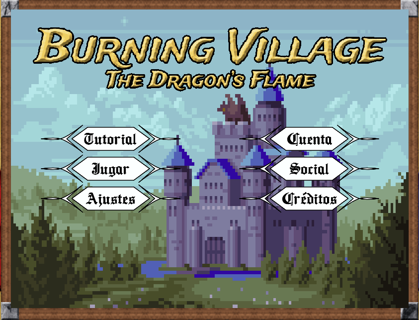  
Créditos:  
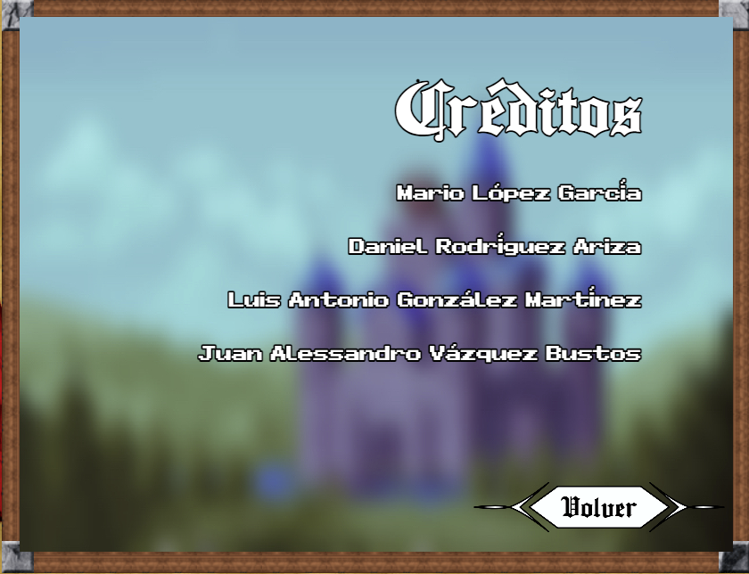  
Partida:  
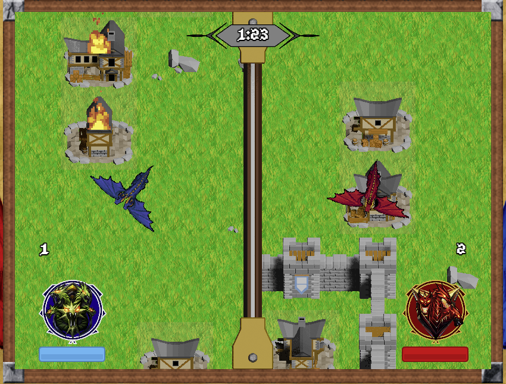  
Game Over:  
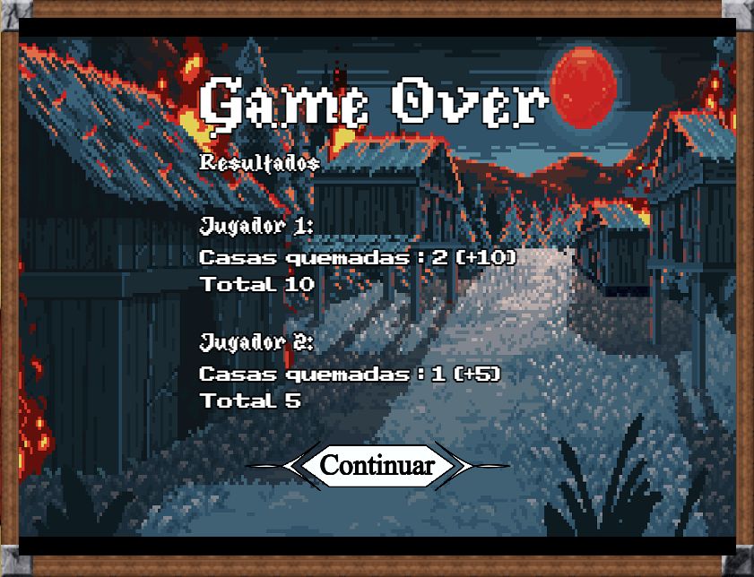  
Tutorial:  
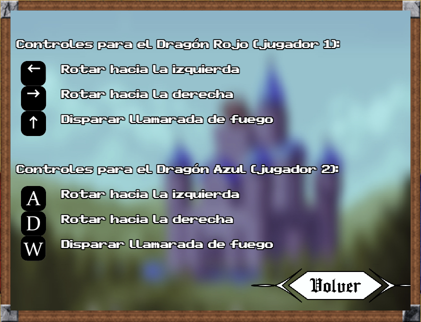  
Menú de acciones de cuenta:  
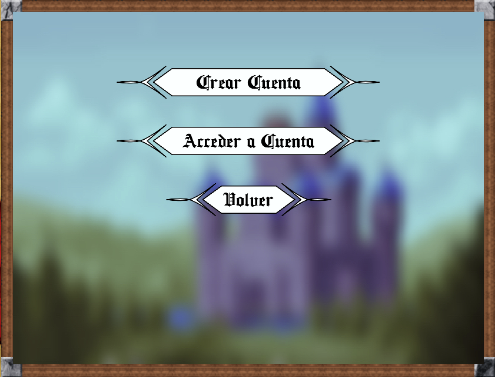  
Creación de cuenta:  
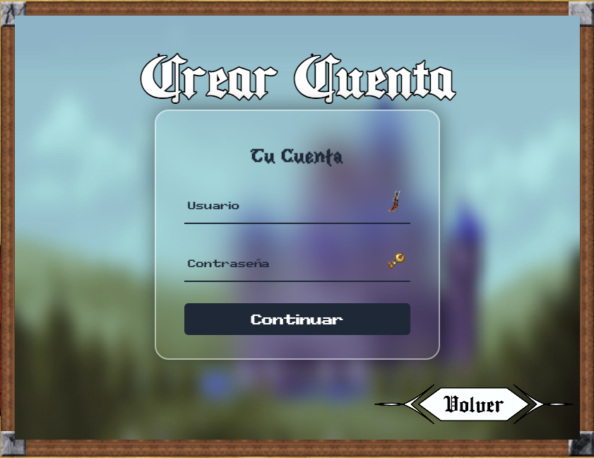  
Acceso a cuenta:  
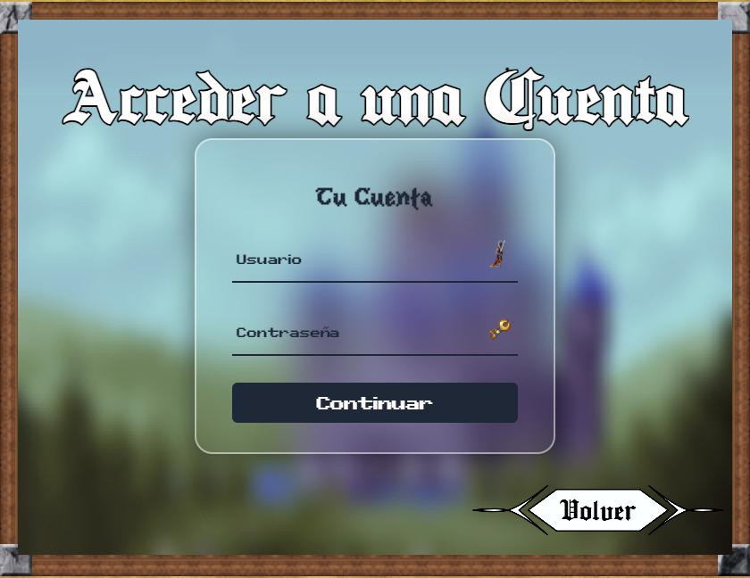  
Menú de cuenta de usuario:  
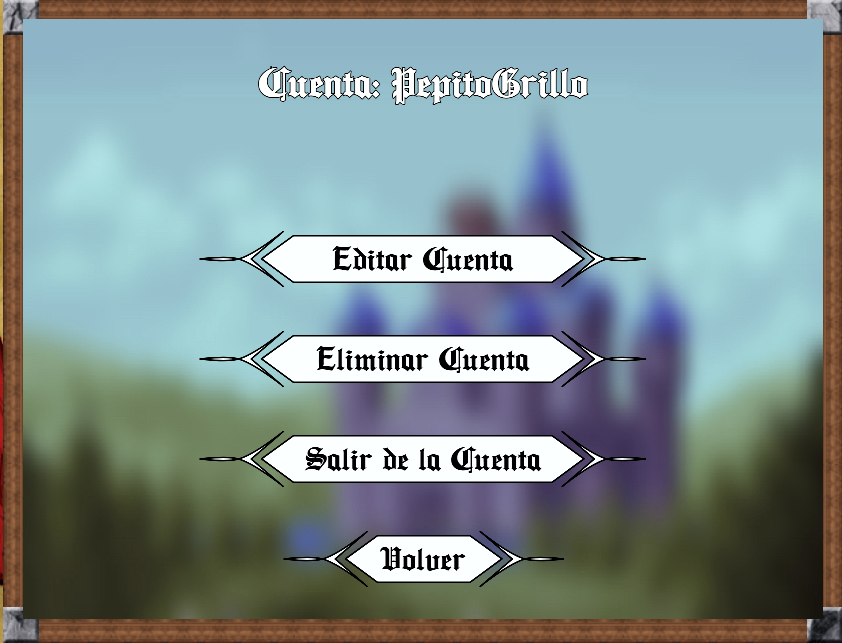  
Cambiar contraseña:  
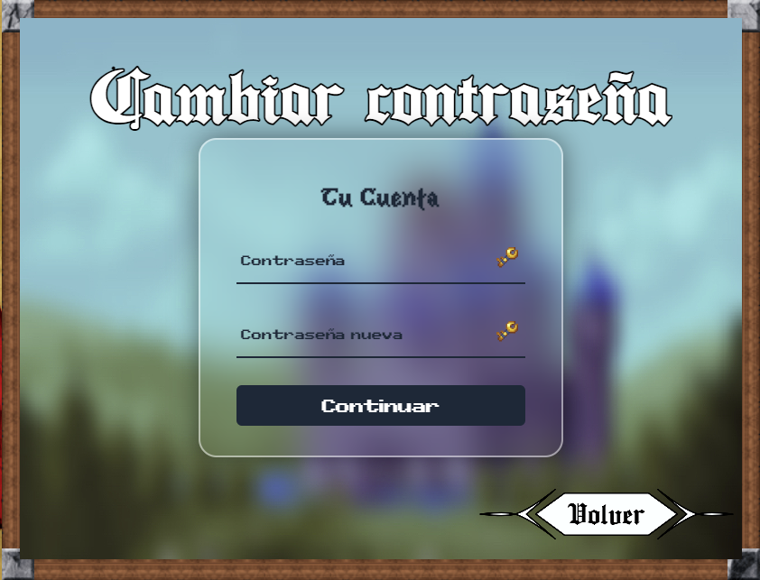  
Borrar cuenta:  
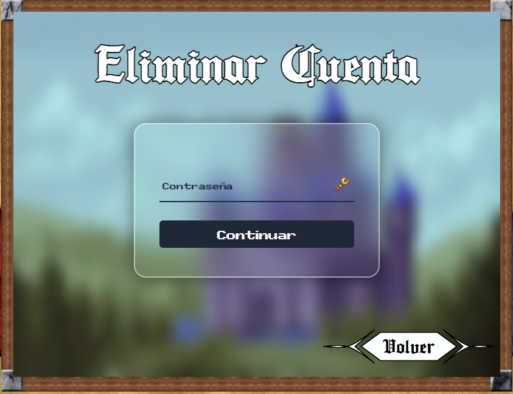  
Menú Social:  
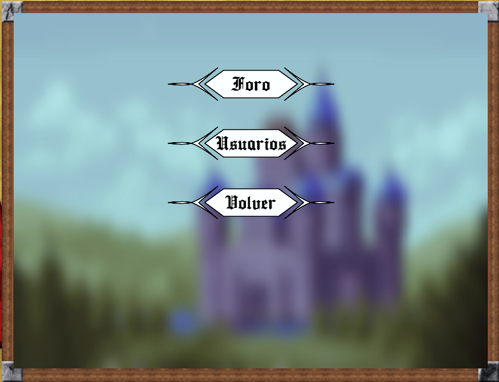  
Chat del Foro de usuarios:  
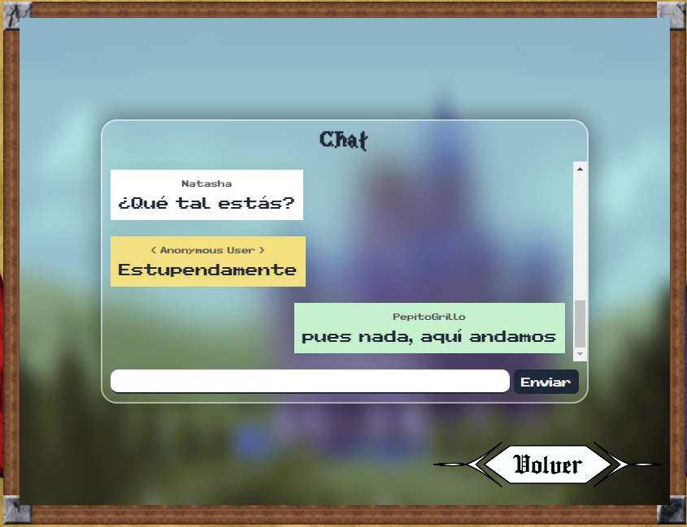  
Tabla de Usuarios:  
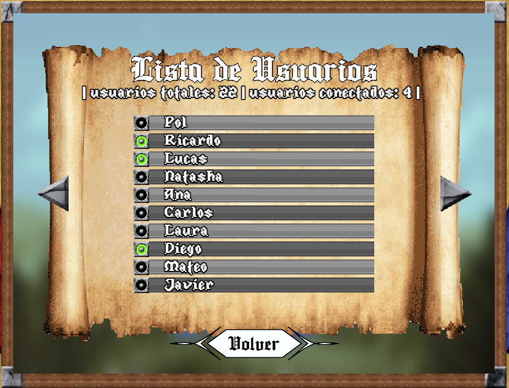  

## Recursos de creación propia
Se han creado recursos propios como sprites para el desarrollo del juego.
- **Sprites de casas medievales:**  
Se ha creado una serie de sprites de casas medievales observadas desde diferentes ángulos para poblar el mundo de casas variadas.  
Cada casa está compuesta por múltiples sprites con diferentes estados de daño.  
Sprites creados por Daniel Rodríguez Ariza: https://github.com/DanielRodriguezAriza  

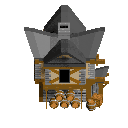
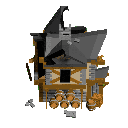
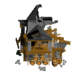
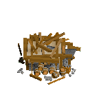  

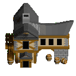
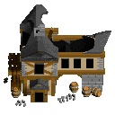
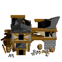
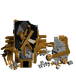  

- **Sprites de castillo medieval:**  
Se ha creado una serie de sprites para el castillo medieval que aparece en el juego.  
Cada elemento del castillo está compuesto por una serie de sprites para representar los distintos estados de daño.  
Sprites creados por Daniel Rodríguez Ariza: https://github.com/DanielRodriguezAriza  

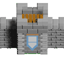
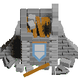
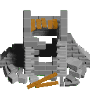
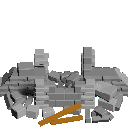  

# Fase 3: Estado del desarrollo (19/12/23)
| Funcion                            | Estado de la implementacion | Fase de finalización | Comentarios |
| ---------------------------------- | --------------------------- | -------------------- | ----------- |
| Controlador API REST usuarios	     | Implementado                |  Fase 3              |             |
| Servicio API REST usuarios         | Implementado                |  Fase 3              |             |
| Creación de usuarios (sign up)     | Implementado                |  Fase 3              |             |
| Acceso a cuenta (login)            | Implementado                |  Fase 3              |             |
| Edición de contraseña              | Implementado                |  Fase 3              |             |
| Eliminación de usuarios            | Implementado                |  Fase 3              |             |
| Controlador API REST mensajes      | Implementado                |  Fase 3              |             |
| Servicio API REST mensajes         | Implementado                |  Fase 3              |             |
| Foro/chat                          | Implementado                |  Fase 3              |             |
| Controlador API REST status        | Implementado                |  Fase 3              |             |
| Estado de conexión usuarios        | Implementado                |  Fase 3              |             |
| Lista de usuarios                  | Implementado                |  Fase 3              |             |
| Nivel                              | Implementado                | - Fase 4             |             |
| Buscar partida                     | Por implementar             | - Fase 4             |             |
| Ajustes                            | Por implementar             | - Fase 4             |El botón esta implementado pero no tiene función|
| Sonidos                            | Por implementar             | - Fase 4             |             |

## Gestión de usuarios

- Se pueden **crear usuarios** desde: Cuenta -> crear cuenta -> 'escribes usuario y contraseña' -> continuar
- Si se quiere **acceder desde una cuenta ya creada** se puede hacer desde: Cuenta -> Acceder a cuenta -> 'escribes usuario y contraseña' -> continuar
  - Automáticamente queda la sesión de dicho usuario iniciada, si escribe en el chat los mensajes llevarán su nombre, y si se mira el 
   libro de usuarios su nombre aparecerá con un cuadrado verde que indica que está en linea. 

- Si el usuario se **desconecta** desde: Cuenta -> Salir de la cuenta 
Automáticamente dicho usuario cierra su sesión, y si escribe en el chat será un usuario anónimo.

- El usuario puede **cambiar su contraseña** desde: Cuenta -> Editar Cuenta -> 'escribir su contraseña antigua y debajo la nueva'

- El usuario puede **eliminar su cuenta** desde: Cuenta > Eliminar cuenta > 'Introduce la contraseña' > Continuar
  Dicho usuario desaparecerá del libro de usuarios. Y del registro de cuentas.
  
- Para acceder al **libro de usuarios registrados y en linea**: Social -> Usuarios
  Aparecerá un libro en el que los usuarios activos tienen un cuadrado de color verde, y los inactivos gris

## Foro / Chat
- El foro permite enviar objetos JSON al servidor para que este los comparta con el resto de usuarios en el chat de forma casi instantánea.
- La estructura de estos objetos es siempre la misma: {"postId": 0, "authorId": 0, "postContent": "Contenido del mensaje"}
  - Guardando estos un id único para el post, el cual se puede utilizar para buscar un post determinado y se elige automáticamente al 
    momento de crear el objeto post, no se puede elegir como tal.
  - Un id del autor que lo ha escrito para que si se quisiera sea posible implementar una busqueda de posts por nombre de usuario.
  - El contenido del post que simplemente es la cadena de texto en la que se puede embeber codigo html incluyendo imágenes. 
  - Si se envía un post sin tener una sesión activa, el id de su autor será -1 y se mostrará como mensaje de un usuario anónimo.

# Fases 4 y 5: Estado del desarrollo (07/12/23)
| Funcion                            | Estado de la implementacion | Fase de finalización | Comentarios |
| ---------------------------------- | --------------------------- | -------------------- | ----------- |
| Nivel                              | Implementado                | - Fase 4             |             |
| Matchmaking                        | Implementado                | - Fase 4             |             |
| Sistema de creación de salas online| Implementado                | - Fase 4             |             |
| Cosméticos, personalización        | Implementado                | - Fase 5             |             |
| Buscar partida                     | Implementado                | - Fase 4             |             |
| Música                             | Implementado                | - Fase 5             |             |
| Ajustes                            | Implementado                | - Fase 5             |	        |
| Sonidos                            | Implementado                | - Fase 4             |             |

## Pantalla de emparejamiento automática
Cualquier usuario registrado o no (como anónimo)  puede utilizar la funcion **matchmaking**
Accesible desde Jugar -> Partida Online -> Listo

Aparecerá una pantalla de sala de espera, hasta que otro jugador acceda al mismo sitio. 
En este momento, aparecerán ambos jugadores y la partida dará comienzo en el momento en el que ambos pulsen el boton listo.

## Pantalla de creación de salas

Cualquier usuario registrado o no (como anónimo)  puede **crear y unirse a salas** de juego.
Se puede acceder desde Jugar -> Lista de Salas -> crear o unirse

Si un jugador ya ha creado una sala, aparecerá entre las salas disponibles para unirse.
Si se prefiere se puede crear una sala nueva con la opción 'crear' u unirse a una creada.
Una vez dentro de una sala el funcionamiento es similar al de emparejamiento automático. 
Cuando ambos jugadores pulsen el boton listo, la partida dará comienzo.

## Actualización en tiempo real de los datos para el correcto funcionamiento de la partidas online

- **Posición y rotación de los dragones**: La posición [x,y] de los dragones se gestiona enviando periodicamente la posición de cada dragón al servidor y seteando estas en cada cliente. La rotación consiste en un valor en radianes que también se actualiza periodicamente en cada cliente.
- **Llamaradas de los dragones**: Se ha modificado la forma de lanzar llamas de los dragones. Ahora al pulsar el boton se lanzan toda las llamas de la munición máxima de golpe. De esta forma solo se debe gestionar con el servidor si el dragón ha pulsado la tecla disparo, y reproducir el lanzamiento de las llamas en el otro cliente, saliendo en la dirección correcta en todo momento gracias a la actualización de posición y rotación del punto anterior.
- **Salud de los dragones**: Cada dragón recibe periodicamente la salud de su contrincante y envía la suya.
- **Puntución**: Cada dragón envía su puntuación a su adversario para que esta se muestre en ambos clientes
- **Tiempo**: Se transmite el tiempo restante de la partida (gameTime.currentTime)

## Protocolo utilizado sobre WebSockets:

Los mensajes enviados por WebSockets entre el cliente y el servidor son mensajes codificados en JSON.

La comunicación se realiza sobre WebSockets en la dirección ws://address/multiplayer

Los mensajes en formato JSON están compuestos por una serie de campos que permiten determinar qué tipo de acción e información quiere realizar el cliente al comunicarse con el servidor.

Se ha creado una función que permite estructurar mensajes y objetos JSON en cadenas que puedan ser comprendidas por el servidor.

Los mensajes contienen un campo "actionType", que contiene un string que determina el tipo de acción que el cliente quiere realizar al comunicarse con el servidor.
Los tipos de acciones disponibles para el cliente son:
	
- **"create-lobby":** Permite enviar un mensaje de solicitud para crear una nueva sala en el servidor.
	
- **"join-lobby":** Permite enviar un mensaje de solicitud para conectarse a una sala existente con una ID específica.
	
- **"send-data":** Permite enviar un mensaje con datos del estado de la partida y relevantes sobre el cliente (nombre, ID de jugador, ID de usuario, vida, posición, rotación, etc...). El mensaje es enviado al servidor, los datos son procesados y almacenados en el servidor, actualizando la información de la sala en la que se encuentre conectado el jugador. Posteriormente, el mensaje es retransmitido a todos los clientes que estén conectados en la misma sala. Este tipo de mensaje es utilizado cuando se necesita transmitir información principal y relevante tanto para el servidor como para los clientes (jugadores conectados y su estado).
	
- **"forward-data":** Permite enviar un mensaje a todos los clientes conectados a la misma sala sin ser procesado por el servidor. El servidor simplemente actúa como intermediario y le envía el mensaje a los clientes sin realizar ningún tipo de procesado. Este tipo de mensaje es utilizado para comunicar información que no debe de ser almacenada en el servidor pero si que es relevante comunicarla entre los clientes.
	
- **"match-making":** Permite enviar un mensaje de solicitud al servidor para realizar una conexión a una sala por match making automatizado. El servidor, al recibir el mensaje del cliente, buscará una sala apropiada con slots libres para conectar al cliente. Si no existe ninguna sala a la que se pueda conectar el jugador, se creará una nueva sala y se le conectará al jugador a dicha sala.
	
- **"get-server-info":** Permite enviar un mensaje al servidor de solicitud para obtener la información de todas las salas que existen en el servidor. El servidor le devuelve al cliente un mensaje con todas las salas y la información de dichas salas.
	
- **"leave-lobby":** Permite enviar una notificación al servidor de que el usuario ha decidido abandonar una sala deliberadamente. Es utilizado para notificar una desconexión realizada a propósito. En caso de haber un error en la conexión, el servidor lo detectará sin haber recibido este mensaje, lo que permite al servidor diferenciar entre desconexiones deliberadas y desconexiones accidentales.

El servidor también puede enviarle mensajes al cliente. Estos mensajes también tienen un campo JSON "actionType". De esta manera, el cliente puede determinar el tipo de acción que ha de realizar al recibir el mensaje del servidor.
	
- **"lobby-info":** Cuando el cliente recibe este tipo de mensaje, automáticamente actualiza en memoria la información del lobby con todos los datos de los clientes conectados a la misma sala (nombres, posiciones, vidas, puntuaciones, rotaciones, etc...)
	
- **"forward-data":** Cuando el cliente recibe este tipo de mensaje, el receptor es responsable de analizar la información obtenida para saber cómo procesar los datos recibidos. El procesado se hace analizando el campo "petition", que contiene el tipo de petición o información que los clientes quieren comunicar directamente al resto de clientes.
		
Los tipos de mensajes que se pueden obtener por forward-data dependen de la situación. El caso más notable es "ask-for-world". Este tipo de mensaje contiene la información del mundo, lo que permite sincronizar el mapa en los clientes al jugar en multijugador online.

La conexión en el lado del cliente tiene una serie de funciones en su API pública que permite realizar todas estas acciones de forma automática sin necesidad de componer todos los mensajes de forma manual.

## Recursos externos utilizados
Para el desarrollo del juego se han utilizado algunos recursos externos:
- **Imagen del menú inicial y menú de créditos:**
Se ha usado el arte de Medieval Fantasy de Slynyrd. Puedes visitarlo aquí: <https://www.slynyrd.com/blog/2019/4/23/pixelblog-16-medieval-fantasy>
- **Sprites para el fuego pixel:**
Se han utilizado los sprites Fire Animation de Brullov. Puedes visitarlo aquí: <https://brullov.itch.io/fire-animation>
- **Fuentes tipográficas:**
Se han utilizado 2 fuentes tipográficas de estilo pixel art. La primera es Medieval Pixel de Goatmeal (<https://fontstruct.com/fontstructions/show/640368/medieval_pixel>), y la segunda es Pixel Sans Serif de Muhd Rusyaidi (<https://www.dafont.com/pixel-sans-serif.font>).
- **Imágenes para las barras de vida:**
Las imágenes que posibilitan las barras de vida de los dragones son parte del pack UI Pack (Space Expansion) de Kenney, puedes visitarlo aquí: <https://kenney.nl/assets/ui-pack-space-expansion>
- **Imagen animada de Game Over:**
La imagen de la pantalla de Game Over es un gif llamado Town on fire de Pablo Gómez, puedes visitarlo aquí: <https://www.artstation.com/artwork/aoXLrk>
- **Tutorial para hacer un Timer en Phaser 3:**
Se ha seguido el tutorial de la siguiente página del foro de Phaser: <https://phaser.discourse.group/t/countdown-timer/2471>
- **Tutorial para crear una barra de vida animada:**
Se ha seguido el siguiente tutorial de la página Ourcade.co: <https://blog.ourcade.co/posts/2020/animated-health-bar-phaser-3/>
- **Imagen animada de un soldado medieval para el usuario:**
La imagen que se usa para el usuario en las pantallas de registro e inicio de sesión es un gif parte del pack Medieval Soldier Pixel Art Animations de Jens Steenmetz, puedes visitarlo aquí: <https://www.artstation.com/artwork/14XNNo>
- **Imagen animada de una llave para la contraseña:**
La imagen que se usa para la contraseña en las pantallas de registro, inicio de sesión, cambiar contraseña y eliminar cuenta es un gif de Origin Realms llamado Cosmo Crate Key, puedes visitarlo aquí: <https://originrealms.fandom.com/wiki/Cosmo_Crate_Key>

## Bibliografía

BoardgamingParent. (2023, 31 agosto). 7 Strategy games like Risk when you’re ready for more. BoardgamingParent.com. <https://boardgamingparent.com/6-great-games-like-risk-for-something-extra/>

Colaboradores de Wikipedia. (2023). Risk. Wikipedia, la enciclopedia libre. <https://es.wikipedia.org/wiki/Risk>

Colaboradores de Wikipedia. (2023). Videojuego de estrategia en tiempo real. Wikipedia, la enciclopedia libre. <https://es.wikipedia.org/wiki/Videojuego_de_estrategia_en_tiempo_real>

Colaboradores de Wikipedia. (2023). Género de videojuegos. Wikipedia, la enciclopedia libre. <https://es.wikipedia.org/wiki/G%C3%A9nero_de_videojuegos>

Colaboradores de Wikipedia. (2023). Arcade. Wikipedia, la enciclopedia libre. <https://es.wikipedia.org/wiki/Arcade>

Colaboradores de Wikipedia. (2023). Videojuego casual. Wikipedia, la enciclopedia libre. <https://es.wikipedia.org/wiki/Videojuego_casual>

Countdown timer. (2019, 16 mayo). Phaser. <https://phaser.discourse.group/t/countdown-timer/2471/3>  

¿Cuántos tipos de videojuegos hay? (2022, 20 julio). IFEMA MADRID. <https://www.ifema.es/noticias/videojuegos/tipos-videojuegos>

Fire Animation - Pixel Art FX Sprites 🔥 by Brullov. (s. f.). itch.io. <https://brullov.itch.io/fire-animation>  

How middle-aged women are turning ‘casual’ gaming into a billion-dollar addiction. (2010, 18 diciembre). BrainStation. <https://brainstation.io/magazine/how-middle-aged-women-are-turning-casual-gaming-into-a-billion-dollar-addiction>

Kenney. (s. f.). UI Pack (Space Expansion) · Kenney. <https://kenney.nl/assets/ui-pack-space-expansion>  

Leung, T. (2020, 12 junio). Create an animated health bar in Phaser 3. Ourcade Blog. <https://blog.ourcade.co/posts/2020/animated-health-bar-phaser-3/>  

Medieval Pixel. (2014, 10 julio). fontstruct.com. <https://fontstruct.com/fontstructions/show/640368/medieval_pixel>  

Pixel sans serif font | Dafont.com. (s. f.). <https://www.dafont.com/pixel-sans-serif.font>  

Schlitter, R. (2023, 6 junio). Pixelblog - 16 - Medieval Fantasy — SLYNYRD. SLYNYRD. <https://www.slynyrd.com/blog/2019/4/23/pixelblog-16-medieval-fantasy>  

Stalberg, A. (2023). Games to play if you love medieval fantasy. Game Rant. <https://gamerant.com/games-play-love-medieval-fantasy/#divinity-original-sin-2>

Town on Fire, Pablo Gomez. (s. f.). ArtStation. <https://www.artstation.com/artwork/aoXLrk>  

What is the difference between casual and arcade game category? (s. f.). Quora. <https://www.quora.com/What-is-the-difference-between-casual-and-arcade-game-category>

Wikipedia contributors. (2023). Action Game. Wikipedia. <https://en.wikipedia.org/wiki/Action_game>
